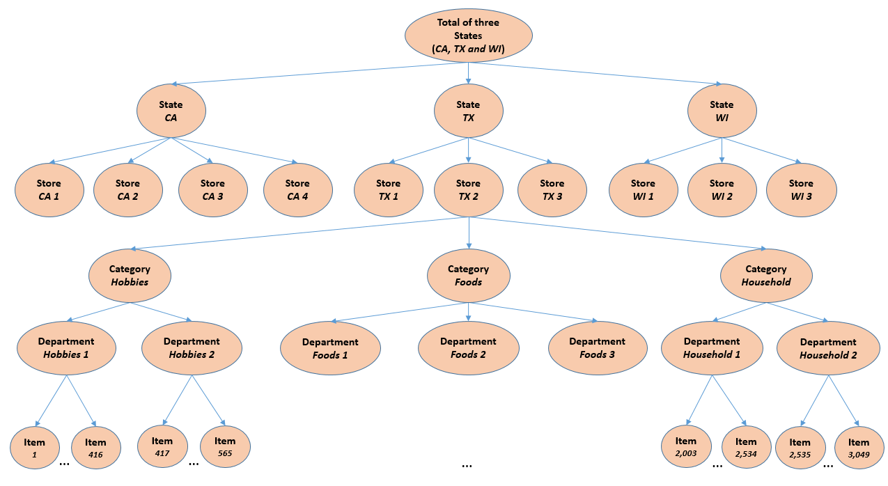

# M5_competition
Time series forecasting competition on https://www.kaggle.com/c/m5-forecasting-accuracy.

## Objectives
The objective of the M5 forecasting competition is to advance the theory and practice of forecasting by identifying the method(s) that provide the most accurate point forecasts for each of the 42,840 time series of the competition. I addition, to elicit information to estimate the uncertainty distribution of the realized values of these series as precisely as possible. 

## Dataset Description
The M5 dataset, generously made available by Walmart, involves the unit sales of various products sold in the USA, organized in the form of grouped time series. More specifically, the dataset involves the unit sales of 3,049 products, classified in 3 product categories (Hobbies, Foods, and Household) and 7 product departments, in which the above-mentioned categories are disaggregated.  The products are sold across ten stores, located in three States (CA, TX, and WI). In this respect, the bottom-level of the hierarchy, i.e., product-store unit sales can be mapped across either product categories or geographical regions, as follows:

Figure 1 retrieved from: https://mofc.unic.ac.cy/m5-competition/

Figure 1: An overview of how the M5 series are organized.
The historical data range from 2011-01-29 to 2016-06-19. Thus, the products have a (maximum) selling history of 1,941  days / 5.4 years (test data of h=28 days not included). 

The M5 dataset consists of the following three (3) files:

File 1: “calendar.csv” 
Contains information about the dates the products are sold.
•	date: The date in a “y-m-d” format.
•	wm_yr_wk: The id of the week the date belongs to.
•	weekday: The type of the day (Saturday, Sunday, …, Friday).
•	wday: The id of the weekday, starting from Saturday.
•	month: The month of the date.
•	year: The year of the date.
•	event_name_1: If the date includes an event, the name of this event.
•	event_type_1: If the date includes an event, the type of this event.
•	event_name_2: If the date includes a second event, the name of this event.
•	event_type_2: If the date includes a second event, the type of this event.
•	snap_CA, snap_TX, and snap_WI: A binary variable (0 or 1) indicating whether the stores of CA, TX or WI allow SNAP  purchases on the examined date. 1 indicates that SNAP purchases are allowed.

File 2: “sell_prices.csv”
Contains information about the price of the products sold per store and date.
•	store_id: The id of the store where the product is sold. 
•	item_id: The id of the product.
•	wm_yr_wk: The id of the week.
•	sell_price: The price of the product for the given week/store. The price is provided per week (average across seven days). If not available, this means that the product was not sold during the examined week. Note that although prices are constant at weekly basis, they may change through time (both training and test set).  

File 3: “sales_train.csv” 
Contains the historical daily unit sales data per product and store.
•	item_id: The id of the product.
•	dept_id: The id of the department the product belongs to.
•	cat_id: The id of the category the product belongs to.
•	store_id: The id of the store where the product is sold.
•	state_id: The State where the store is located.
•	d_1, d_2, …, d_i, … d_1941: The number of units sold at day i, starting from 2011-01-29. 

Dataset Description retrieved from the competition guidelines: https://mofc.unic.ac.cy/m5-competition/

## Learning

## 

# Predicting E-Commerce Customer Behavior

Youtube video link on this project: http://youtu.be/qIrvmW8sCBM?hd=1

## Background 
Every day there are more and more companies selling their products online versus in brick-and-mortar stores.  These companies collect data on their customers' behavior purchasing products and services online.  This data is very valuable to companies.  They analyze this data to acquire insights on their customers' buying behavior patterns.  The analysis will provide leverage to the company by creating new strategies to market customers.  In this project, I will use e-commerce data provided by a company in Turkey to predict the buying patterns of customers.  

## Objective
I will use machine learning to create a predictive model.  This model will use customers' attributes to predict whether a visitor/customer will make a purchase or not.  This model can be used for a e-commerce website to trigger a recommendation system to provide a visitor product recommendation based on the model's prediction this visitor will purchase something.

## Learning
I want to challenge myself in learning how to host and deploy a machine learning model in Google Cloud Platform (GCP).  I also wanted to learn how to write a simple Flask web application using the model I build in this project to predict whether a customer will purchase a product or not.  In addition to GCP and Flask, I wanted to learn how build machine learning pipelines to help automate the model selection process.

## Dataset
The dataset comes from a Turkey e-commerce company www.gozalangroup.com.tr/.  I extracted the data from https://www.kaggle.com/roshansharma/online-shoppers-intention named Online Shopper's Intention.

The dataset consists of 12,330 customer sessions (rows), 10 numerical and 8 categorical variables (columns). I will use ‘Revenue’ (True or False) variable as my target variable. The other 17 variables will be my predictor variables, customer's attributes, or features. I will engineer more attributes before modeling. This dataset was formed in a one-year period not including holidays, special days, or specific campaigns. The size of the data set is adequate for the data science tasks I plan on performing on it.

## Research Questions
- What are the relatively important customer attributes contributing to customers’ decision to purchase a product?

- Will a customer purchase a product or not on a e-commerce website?

## Insights from EDA

    

This violin plot shows customers that purchase a product is not on the website as long as those that do not purchase an item.  This indicates people who purchase an item generally have an idea what they want, so they do not need to shop on the website as long.  Those customers who are not sure what they want and are shopping to gather information stay on the website longer and do not purchase.  The company can consider strategies to help customers make a decision to purchase through incentives.

The bar graph shows the distributions of the months customers are active and inactive on the website.  We can see the months customers are on the website longest are May and November.  In May, people are shopping for items for summer vacations and summer season.  In November, people are shopping to purchase items for the holidays.  This is valuable information for the company to use in creating marketing campaigns.

## Feature Selection and Engineering
Multicollinearity existed among the numeric variables.  I corrected for this by dropping the following variables: ProductRelated and ExitRates.  I used one hot encoding to create new dummy variables for the categorical variables.

## Data Preprocessing
The numerical variables have outliers and skewd distributions.  I correct for this by normalizing the variables through scaling the numerical variables with StandardScaler in scikit learn.  I encoded the categorical variables with OneHotEncoder in scikit learn.  I created a preprocessing pipeline in scikit learn to automate the process.  In addition to scaling and encoding the data, I split the data into 80% training and 20% testing.

## Model Selection
Since I am predicting a true or false value for revenue, I considered several classification machine learning models.  The following models I considered were Logistic Regression, Support Vector Classifier, Decision Tree Classifier, Random Forest Classifier, Gradient Boosting Classifier, Extreme Gradient Boosting Classifier, Light Gradient Boosting Machine Classifier, and Multi-layer Perceptron Classifier.  I used a machine learning pipeline from scikit learn to display the confusion, accuracy, and classification report for each classifier.  In selecting the model, I used the F1 measure because it is a harmonic mean between precision and recall.  F1 measure accounts for an imbalance in classes of the target variable.  Through this process, I noticed Gradient Boosting Classifier algorithm performed better than all the others with 0.81 macro average.

## Relative Important Features
The top 3 relative important features in predicting purchasing behavior are shopping on the weekend, vistor type, and traffic type.  The various classes within each of these variables have higher importance.  For example, a new visitor in visitor type and traffic type 8 have significant relative importance to predicting whether a customer will purchase or not.

## Further Investigation
I want to investigate how I can use various types of neural networks to predict purchasing behavior.  I am curious about how to incorporate this model into a platform to help companies improve their purchases online.  I want to create an interface for someone to input different customer attributes to see whether that customer will purchase or not.
