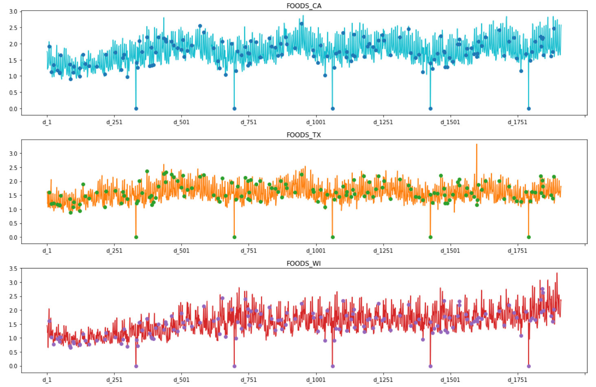
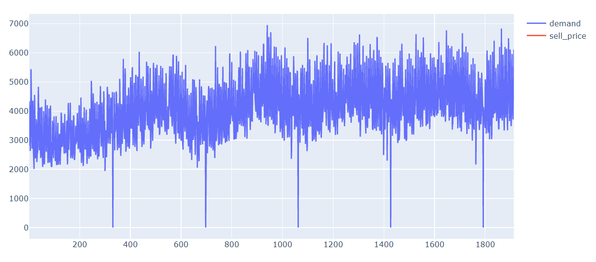
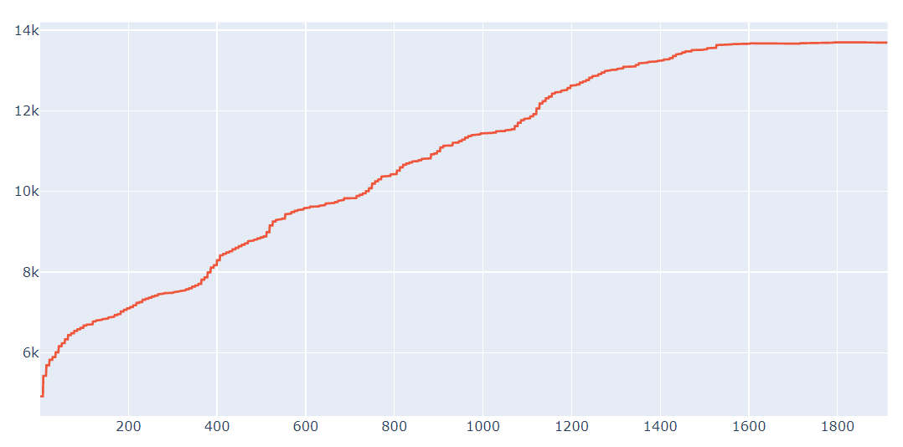
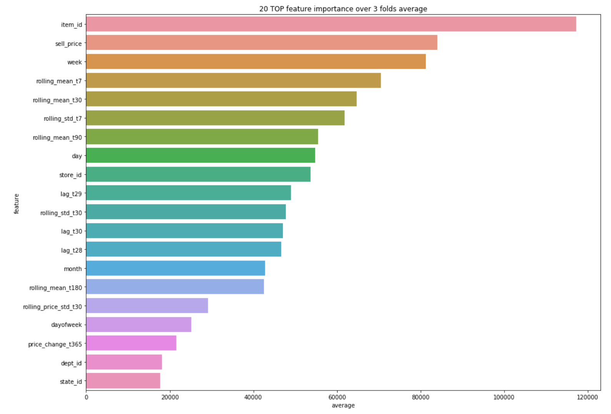

# Slides and Presentation Recording
Slides link: https://tinyurl.com/m5slides

Recording link: https://www.youtube.com/watch?v=FagzF9OAQPc

# M5 Competition
Time series Walmart sales forecasting competition on https://www.kaggle.com/c/m5-forecasting-accuracy.

## Background
There were four previous M competitions to advance the research of forecasting time series.  The competitions used a range of statictical models such as ARIMA to modern machine and deep learning models.  The M5 competition is different to the previous competitions in the following ways:

•	First, it uses grouped unit sales data, starting at the product-store level and being aggregated to that of product departments, product categories, stores, and three geographical areas: the States of California (CA), Texas (TX), and Wisconsin (WI).

•	Second, besides the time series data, it includes explanatory variables such as sell prices, promotions, days of the week, and special events (e.g. Super Bowl, Valentine’s Day, and Orthodox Easter) that typically affect unit sales and could improve forecasting accuracy.

•	Third, in addition to point forecasts, it assesses the distribution of uncertainty, as the participants are asked to provide information on nine indicative quantiles.

•	Fourth, instead of having a single competition to estimate both the point forecasts and the uncertainty distribution, there will be two parallel tracks using the same dataset, the first requiring 28 days ahead point forecasts and the second 28 days ahead probabilistic forecasts for the median and four prediction intervals (50%, 67%, 95%, and 99%).

•	Fifth, for the first time it focuses on series that display intermittency, i.e., sporadic demand including zeros.

Reference:
MOFC. (2020). The M5 Competition Competitors' Guide. Retrieved from:  https://mofc.unic.ac.cy/m5-competition/ 

## Objective
The objective of the M5 forecasting competition is to advance the theory and practice of forecasting by identifying the method(s) that provide the most accurate point forecasts for each of the 42,840 time series of the competition.  To that end, the participants of M5 are asked to provide 28 days ahead point forecasts (PFs) for all the series of the competition.

Reference:
MOFC. (2020). The M5 Competition Competitors' Guide. Retrieved from:  https://mofc.unic.ac.cy/m5-competition/ 

## Research Questions
How to forecast Walmart sales for the next 28 days based on previous sales?

What are some techniques to estimate point forecasts of the unit sales of various products sold in the USA by Walmart?

## Learning
I learned from the project how to analyze time-series sales data.  I learned how to write Python code for exploratory data analyis for time series data, combine multiple data sets, wrangle time-series data, prepare time-series data for modeling, and apply SARIMA, XGBoost, LightGBM, LSTM models to forecast 28 days of sales.  

## Dataset Description
The M5 dataset, generously made available by Walmart, involves the unit sales of various products sold in the USA, organized in the form of grouped time series. More specifically, the dataset involves the unit sales of 3,049 products, classified in 3 product categories (Hobbies, Foods, and Household) and 7 product departments, in which the above-mentioned categories are disaggregated.  The products are sold across ten stores, located in three States (CA, TX, and WI). In this respect, the bottom-level of the hierarchy, i.e., product-store unit sales can be mapped across either product categories or geographical regions, as follows:

Figure 1 retrieved from: https://mofc.unic.ac.cy/m5-competition/

Figure 1: An overview of how the M5 series are organized.
The historical data range from 2011-01-29 to 2016-06-19. Thus, the products have a (maximum) selling history of 1,941  days / 5.4 years (test data of h=28 days not included). 

The M5 dataset consists of the following three (3) files:

File 1: “calendar.csv” 
Contains information about the dates the products are sold.
•	date: The date in a “y-m-d” format.

•	wm_yr_wk: The id of the week the date belongs to.

•	weekday: The type of the day (Saturday, Sunday, …, Friday).

•	wday: The id of the weekday, starting from Saturday.

•	month: The month of the date.

•	year: The year of the date.

•	event_name_1: If the date includes an event, the name of this event.

•	event_type_1: If the date includes an event, the type of this event.

•	event_name_2: If the date includes a second event, the name of this event.

•	event_type_2: If the date includes a second event, the type of this event.

•	snap_CA, snap_TX, and snap_WI: A binary variable (0 or 1) indicating whether the stores of CA, TX or WI allow SNAP  purchases on the examined date. 1 indicates that SNAP purchases are allowed.

File 2: “sell_prices.csv”
Contains information about the price of the products sold per store and date.
•	store_id: The id of the store where the product is sold. 

•	item_id: The id of the product.

•	wm_yr_wk: The id of the week.

•	sell_price: The price of the product for the given week/store. The price is provided per week (average across seven days). If not available, this means that the product was not sold during the examined week. Note that although prices are constant at weekly basis, they may change through time (both training and test set).  

File 3: “sales_train.csv” 
Contains the historical daily unit sales data per product and store.
•	item_id: The id of the product.

•	dept_id: The id of the department the product belongs to.

•	cat_id: The id of the category the product belongs to.

•	store_id: The id of the store where the product is sold.

•	state_id: The State where the store is located.

•	d_1, d_2, …, d_i, … d_1941: The number of units sold at day i, starting from 2011-01-29. 

Reference:
MOFC. (2020). The M5 Competition Competitors' Guide. Retrieved from:  https://mofc.unic.ac.cy/m5-competition/ 

## Insights from EDA

According to the plots above, I can see among the three states there are days with zero sales which is Christmas. I can observe the days before and after Christmas there are higher food sales than other day, and these days are Thanksgiving and the Super Bowl.

An observation of demand and sell_price is as time increase demand and sell_price increases. Demand follows a similar pattern as total sales. Demand in store CA_1 is representative of sales data. The data has seasonality; therefore, does not have stationarity. Before modeling, I will preprocessing the data to correct for seasonality.

## Feature Selection and Engineering
- Data Features
- Lag Features
- Use Lasso Regression for Feature Selection
- Standard Scalar to normalize the features
- Encoded categorical variables with LabelEncoder

## Data Preprocessing
- Merged and melted data frames
- Removed unnecessary columns
- Created new columns
- Splitting data into training and testing datasets
- Normalized the features with Standard Scalar

## Model Selection
I use the RMSE evaluation metric for each model to select the highest performing model.  The model with the lowest RMSE has the best fit to the data for forecasting the Walmart sales data.  The models I use were SARIMAX, Holt-Winters, Linear Regression with Ridge Regression, XGBoost Regressor, LGBM Regressor.  The best performing model is LGBM Regressor with approximately 2.3 RMSE.  This is the model I will use for the forecasting of Walmart sales data for 28 days.

## Relative Important Features

I can see from the relative feature importance that the top 3 features are item_id, sell_price, and week. I think item_id and sell_price makes sense to be the top features for the forecast because the forecast will depend on the items and price of the items. Week also makes sense because the forecast depends on time parameters to make a forecast, so having a time parameter in the top three relative important features is logical.

## Further Investigation
Some future research I want to do is with neural networks for time series such as LSTM.  Another model I want to investigate is the FBprophet models to forecast sales data.  I also want to research how to be more creative in feature engineering for time series data.
